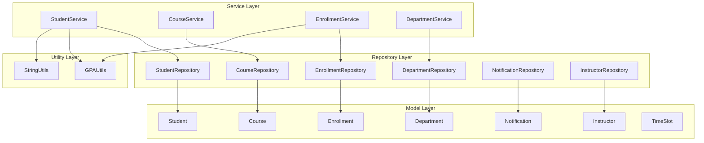
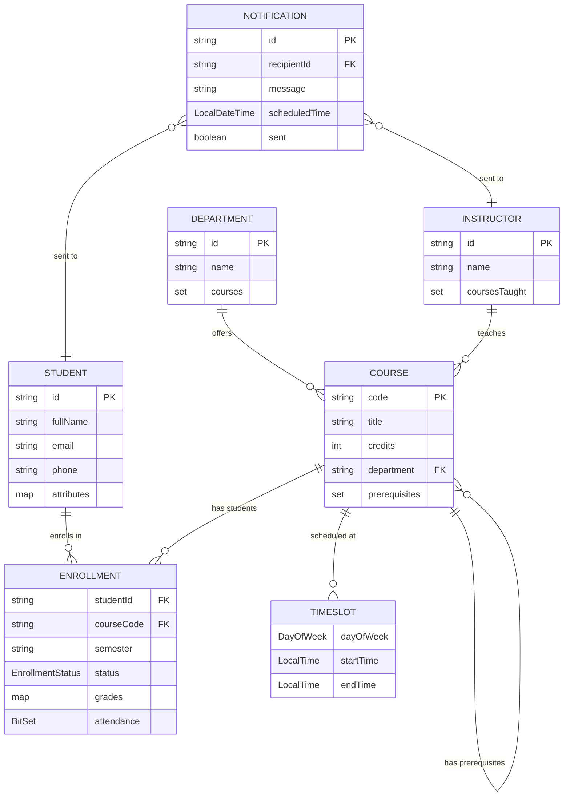

# Student Management System (SMS)

## Overview

An in-memory Student Management System demonstrating extensive use of Java Collections Framework for managing student records, courses, enrollments, and departments in a university setting.

## Current Implementation Status

### Implemented Components

#### Models
- **Student** - Student records with enrollments and attributes
- **Course** - Course catalog with prerequisites and time slots
- **Enrollment** - Student-course enrollments with grades and attendance
- **Department** - Academic departments
- **Instructor** - Faculty information
- **Notification** - System notifications
- **TimeSlot** - Scheduled class times
- **Enums**: EnrollmentStatus, GradeType
- **DTOs**: StudentGpa

#### Repositories (In-Memory)
- **StudentRepository** & **InMemoryStudentRepository** - Student data management
- **CourseRepository** & **InMemoryCourseRepository** - Course catalog management
- **EnrollmentRepository** & **InMemoryEnrollmentRepository** - Enrollment tracking
- **DepartmentRepository** & **InMemoryDepartmentRepository** - Department management
- **InstructorRepository** & **InMemoryInstructorRepository** - Instructor management
- **NotificationRepository** & **InMemoryNotificationRepository** - Notification handling

#### Services
- **StudentService** & **StudentServiceImpl** - Student business logic
- **CourseService** & **CourseServiceImpl** - Course operations
- **EnrollmentService** & **EnrollmentServiceImpl** - Enrollment management
- **DepartmentService** & **DepartmentServiceImpl** - Department operations

#### Utilities
- **GPAUtils** - GPA calculation and grade conversion
- **StringUtils** - String tokenization for search

## Architecture Layers




## Detailed Entity Relationships



### 🔧 Key Collections Framework Usage

- **ConcurrentHashMap** - Thread-safe primary storage in repositories
- **TreeSet** - Sorted time slots and department IDs
- **LinkedHashSet** - Ordered student enrollments
- **HashSet** - Course prerequisites and fast lookups
- **EnumMap** - Efficient grade storage by GradeType
- **BitSet** - Compact attendance tracking
- **CopyOnWriteArrayList** - Read-heavy enrollment lists
- **Collections.synchronizedSet** - Thread-safe department ID sets

### Project Structure

```
src/main/java/
├── api/            # API layer (placeholder)
├── jobs/           # Background jobs (placeholder)
├── model/          # Domain models and DTOs
│   └── dto/        # Data Transfer Objects
├── repository/     # Data access layer interfaces and implementations
├── service/        # Business logic layer interfaces and implementations
└── util/           # Utility classes (GPAUtils, StringUtils)

src/test/java/
├── model/          # Model unit tests
├── repository/     # Repository unit tests 
├── service/        # Service unit tests 
└── util/           # Utility unit tests 
```

### 🎯 Core Features

- **Student Management**: Registration, search by name tokens, contact updates
- **Course Catalog**: Course creation, department-based listing
- **Enrollment System**: Student-course enrollment/dropping with semester tracking
- **Department Management**: Department CRUD operations
- **Grade Tracking**: Multiple grade types with GPA calculation
- **Attendance Tracking**: BitSet-based efficient attendance records
- **Thread Safety**: Concurrent access support across all repositories

## Technology Stack

- **Java 21**
- **Maven** - Build management
- **Lombok** - Boilerplate code reduction
- **JUnit 5** - Unit testing
- **AssertJ** - Fluent assertions